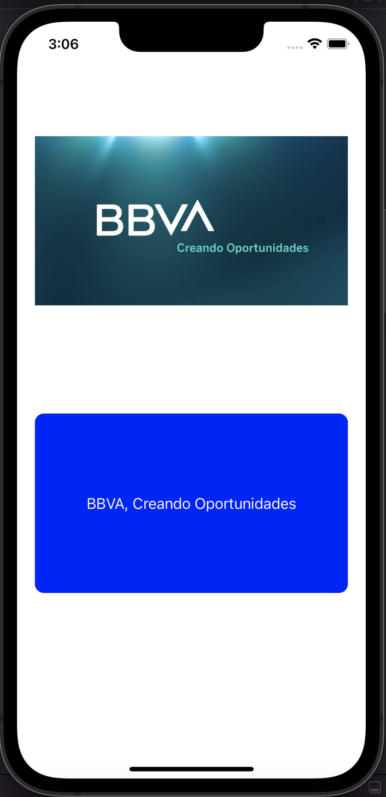
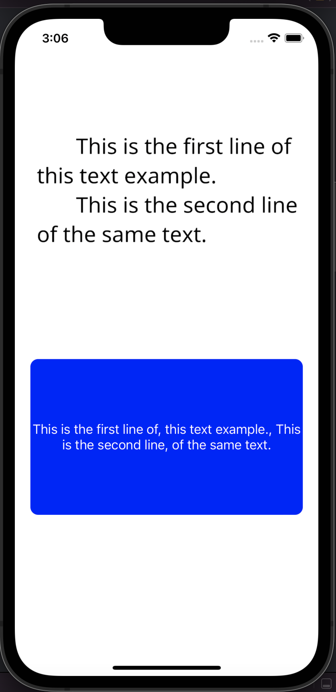
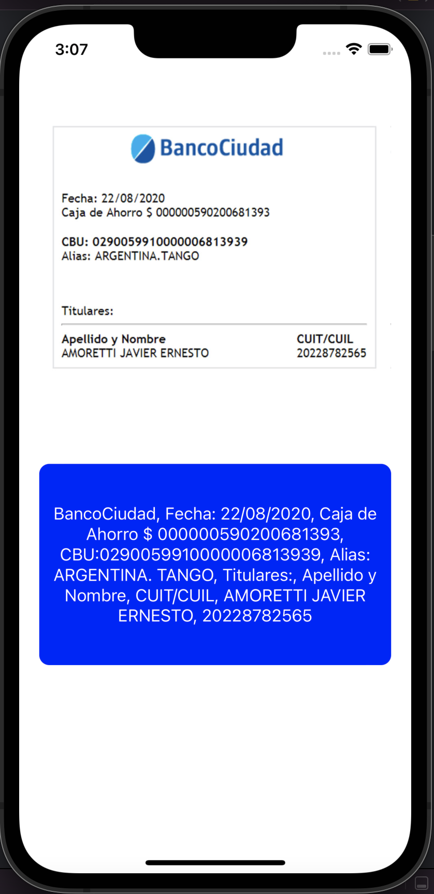

# TextRecognizer

Text Recognizer es una aplicación escrita en Swift 🚀.

Esta aplicación reconoce el texto de las imágenes.

## Requerimientos

- Swift 5.0+
- Xcode 13.0+
- iOS 15.0+ 

## ScreenShots 

| Text | Text | Text |
| :-: | :-: | :-: |
|  |  |  | 

  
## Author

* [**Maximiliano Morales**](https://github.com/maximorales90)

